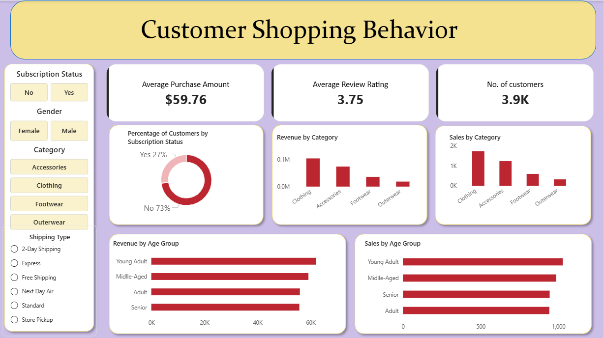

# 🧾 Customer Shopping Behaviour Analysis
Understanding Customer Spending Patterns and Purchase Trends using Python, SQL and Power BI

## 📌 Table of Contents
- <a href="#overview">Overview</a>
- <a href="#business-problem">Business Problem</a>
- <a href="#dataset">Dataset</a>
- <a href="#tools--technologies">Tools & Technologies</a>
- <a href="#project-structure">Project Structure</a>
- <a href="#key-insights">Key Insights</a>
- <a href="#dashboard">Dashboard</a>
- <a href="#how-to-run-this-project">How to Run This Project</a>
- <a href="#final-recommendations">Final Recommendations</a>
- <a href="#author--contact">Author & Contact</a>

---
<h2><a class="anchor" id="overview"></a>Overview</h2>
This project explores customer shopping patterns through data cleaning, exploratory analysis, SQL-based business insights, and interactive dashboard visualization.

---
<h2><a class="anchor" id="business-problem"></a>Business Problem</h2>
Retail businesses generate large volumes of transactional data, but often struggle to convert this data into actionable insights.

This project aims to answer key business questions such as :

- Which customer groups generate the most revenue?
- How do subscriptions impact spending behavior?
- What products are most popular and highly rated?
- Are discounts driving higher sales?
- Which customer segments should businesses target for growth?

---
<h2><a class="anchor" id="dataset"></a>Dataset</h2>

CSV file located in `data` folder

---
<h2><a class="anchor" id="tools--technologies"></a>Tools & Technologies</h2>

- SQL (Common Table Expressions, Filtering)
- Python (Pandas)
- Power BI (Interactive Visualizations)
- GitHub

---
<h2><a class="anchor" id="project-structure"></a>Project Structure</h2>

```
customer-shopping-behaviour-analysis/
|── 
├── READDME.md
├── .gitignore
├── report_of_customer_shopping_behaviour_analysis.pdf
│
├── data/                 # CSV File
│   ├── data_customer_shopping_behavior.csv
│
├── image/                 # Dashboard Preview
│   ├── Customer-Shopping-Behavior-Analysis-Dashboard.png
|
├── notebook/                 # Jupyter Notebook
│   ├── eda_cleandata_customer_shopping_behaviour.ipynb
│
├── dashboard/                # Power BI dashboard file
│   └── dashboard_customer_shopping_behaviour.pbix
│
├── PPT/                      # Powerpoint Presentatio File
│   └── ppt_customer_shopping_behaviour.pptx
|
├── SQL/                      # SQL file
│   └── analyze_customer_shopping_behaviour.sql
```

### Data Cleaning & Preparation

- Loaded and explored data using Pandas.
- Checked dataset structure and summary statistics.
- Handled missing values in the Review Rating column using category-wise median imputation.
- Standardized column names using snake_case formatting.
- Removed redundant columns after consistency checks.

### Feature Engineering

- Created customer age groups.
- Generated purchase frequency metrics.
- Prepared data for business analysis.

### Database Integration

- Connected Python with PostgreSQL.
- Loaded cleaned data into PostgreSQL for SQL-based analysis.

### SQL Business Analysis

- Revenue by gender
- High-spending discount users
- Top-rated products
- Shipping type comparison
- Subscriber vs non-subscriber performance
- Discount dependency analysis
- Customer segmentation
- Product popularity analysis
- Repeat buyer subscription analysis
- Revenue by age group

---
<h2><a class="anchor" id="key-insights"></a>Key Insights</h2>

### Customer Insights
- Customer segmentation identified New, Returning, and Loyal customers.
- Repeat buyers showed stronger engagement and subscription tendencies.

### Revenue Insights
- Revenue contribution varies across age groups and customer demographics.
- Subscription status significantly impacts total revenue and average spending.

### Product Insights
- Certain products consistently achieved higher customer ratings.
- Top-performing products varied across categories.

### Marketing Insights
- Discounts influence purchasing behavior but require careful margin management.
- Loyal customers represent opportunities for retention-focused marketing.

---
<h2><a class="anchor" id="dashboard"></a>Dashboard</h2>
An interactive Power BI dashboard was developed to visualize:

- Revenue distribution by gender
- Revenue contribution by age group
- Customer segmentation analysis
- Subscriber vs non-subscriber comparison
- Product category performance
- Top-rated products
- Discount usage trends
- Shipping type analysis



---
<h2><a class="anchor" id="how-to-run-this-project"></a>How to Run This Project</h2>

### Clone the Repository :

``` bash
git clone https://github.com/yourusername/customer-shopping-behaviour-analysis.git
cd customer-shopping-behaviour-analysis
```

### Install Dependencies :
``` bash 
pip install pandas 
```

### Setup PostgreSQL
- Create a PostgreSQL database.
- Update database credentials in the Python script.

### Run Data Cleaning & Analysis 
``` bash
python customer_shopping_analysis.py
```

### Execute SQL Queries
Run the SQL scripts inside PostgreSQL or pgAdmin.

### Open Power BI Dashboard
- Open the `.pbix` file.
- Refresh data connections if required.

---
<h2><a class="anchor" id="final-recommendations"></a>Final Recommendations</h2>

- Strengthening Subscription benefits 
- Implementing loyalty programs
- Optimizing discount strategies
- Focusing marketing efforts on High-Revenue customer groups

---
<h2><a class="anchor" id="author--contact"></a>Author & Contact</h2>

**Jaya Kumar**  
Aspiring Data Analyst  
📧 Email: jayaxkumar7@gmail.com  
🔗 [LinkedIn](https://www.linkedin.com/in/jaya-kumar-a857173a1/)  
